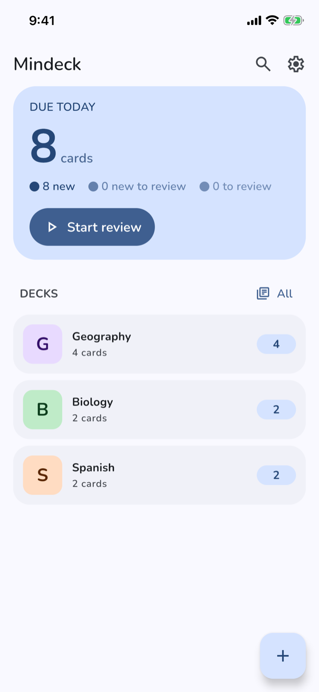
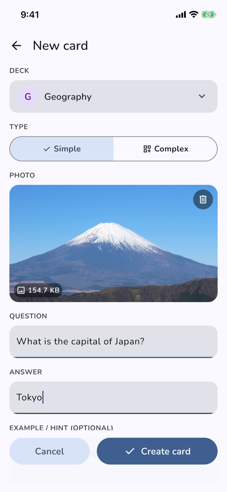
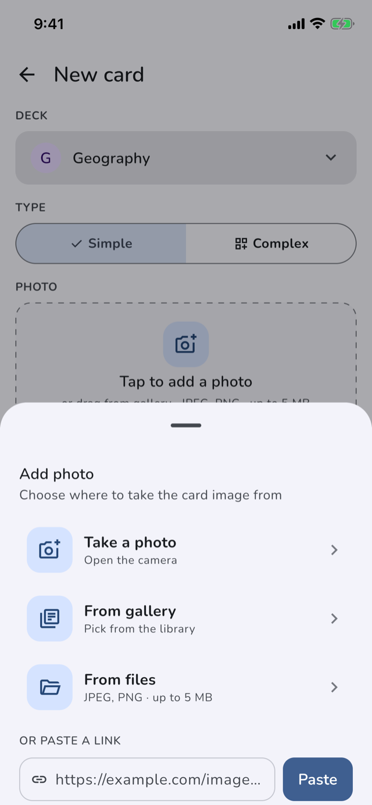

# Mindeck

[](https://github.com/DenisFrolkov/mindeck-app/actions/workflows/ci.yml)
[](LICENSE)
[](https://developer.android.com/about/versions/oreo)
[](https://kotlinlang.org)

A clean, minimalist flashcard app for **Android and iOS**, built with Kotlin Multiplatform + Compose Multiplatform and powered by the **SM-2 spaced repetition algorithm**. Cards surface at the right moment — often enough to remember, rarely enough to stay efficient.

Built as a portfolio project demonstrating Clean Architecture, CQRS, and modern Kotlin Multiplatform development practices.

---

## Screenshots

<p align="center">
  
  &nbsp;&nbsp;
  
  &nbsp;&nbsp;
  
</p>

<p align="center"><sub>Running on iOS (Compose Multiplatform) — the same shared UI also runs on Android.</sub></p>

---

## Features

- Create and organize cards into decks
- Two card types: Simple and Complex
- Attach an image to a card — from the gallery, device files, camera capture, or by URL
- Spaced repetition study sessions based on SM-2
- Four-button rating system: **Again / Hard / Good / Easy**
- Daily limit of 20 new cards
- Cards progress through states: `NEW → LEARNING → REVIEW` (with `LAPSE` on forgetting)

---

## How Spaced Repetition Works

Mindeck implements the [SM-2 algorithm](https://www.super-memory.com/english/ol/sm2.htm) (Piotr Wozniak, 1990) with Anki-style adjustments for Hard/Easy multipliers.

Each card tracks its ease factor, review interval, and learning step. After each study session the next review date is calculated automatically — cards due today are shown first, new cards are capped at 20/day.

---

## Tech Stack

| Layer | Technology |
|---|---|
| Language | Kotlin 2.3.21 (Kotlin Multiplatform) |
| UI | Compose Multiplatform 1.11.0 + Material3 |
| Navigation | Decompose 3.5.0 |
| DI | Koin 4.2.1 |
| Database | Room 2.8.4 (KMP) |
| Async | Coroutines 1.11.0 + StateFlow |
| Networking | Ktor 3.4.0 (image-by-link download) |
| Media | FileKit 0.14.1 (gallery/files), Peekaboo 0.5.2 (camera) |
| Build | AGP 9.0.1, KSP 2.3.8 |
| Min SDK | 26 (Android 8.0) |
| iOS | Native app shell (SwiftUI) hosting the shared Compose UI |

---

## Architecture

Clean Architecture, Kotlin Multiplatform (Android + iOS):

```
domain/               ← Models, Repository interfaces, Use Cases (CQRS)
data/                 ← Room DB, DAOs, Mappers, Repository impls, Koin modules
core/
├── mvi/              ← Shared Store<State, Intent, Effect> MVI framework
└── ui/               ← Shared Compose components (theme, dialogs, media sheet)
feature/
├── home/             ← Home screen (decks overview, daily review)
└── card/             ← Create-card screen (form, media pickers)
app/                  ← Shared navigation (Decompose) & DI wiring
androidApp/           ← Android entry point (MainActivity)
iosApp/               ← iOS entry point (SwiftUI shell)
```

Use cases follow CQRS — split into `command/` (writes) and `query/` (reads):
- Commands: `CreateCardUseCase`, `DeleteCardUseCase`, `UpdateCardReviewUseCase`, …
- Queries: `GetCardsRepetitionUseCase`, …

Navigation is built on [Decompose](https://arkivanov.github.io/Decompose/): a `RootComponent`
drives a serializable `Config` (`Home` / `CreateCard`) through `NavCommand.Push`/`Pop`.

---

## Getting Started

### Prerequisites

- Android Studio Meerkat or newer (Android) / Xcode (iOS)
- JDK 17
- Android SDK 36

### Android — build from source

```bash
git clone https://github.com/DenisFrolkov/mindeck-app.git
cd mindeck-app
./gradlew :androidApp:assembleDebug
```

APK will be at `androidApp/build/outputs/apk/debug/androidApp-debug.apk`.

### iOS — build from source

Open `iosApp/Mindeck.xcodeproj` in Xcode and run on a simulator or device.

### Download APK

A signed release APK is available on the [Releases](https://github.com/DenisFrolkov/mindeck-app/releases) page.

---

## Author

**Denis Frolkov** — [GitHub](https://github.com/DenisFrolkov) · [LinkedIn](https://www.linkedin.com/in/denis-frolkov/) · [Telegram](https://t.me/o2232) · [Email](mailto:denisfrolkov3@gmail.com)

---

## License

[MIT](LICENSE)
